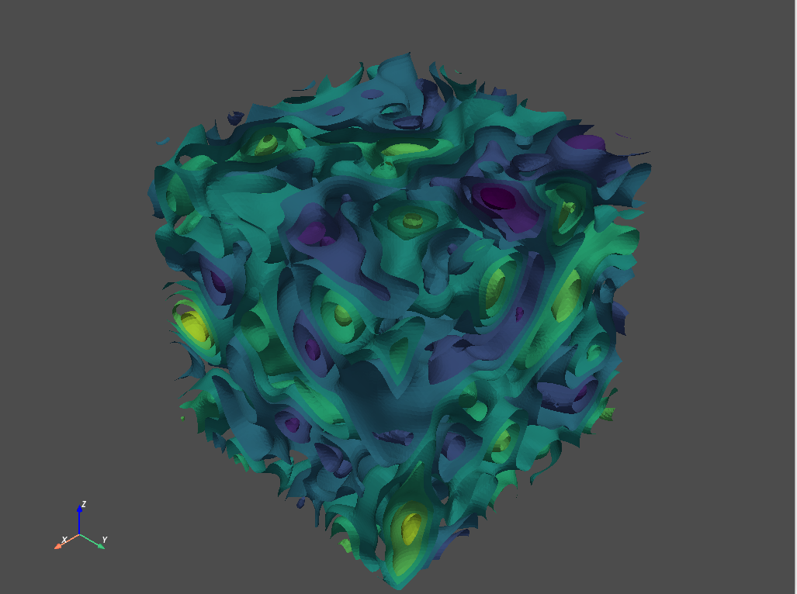

# Gaussian Random Field with FFT-MA

Generate Gaussian random fields with [FFT-MA](https://link.springer.com/article/10.1023/A:1007542406333)

This is modified from [mGstat](https://github.com/cultpenguin/mGstat)

2D example:

3D example:

